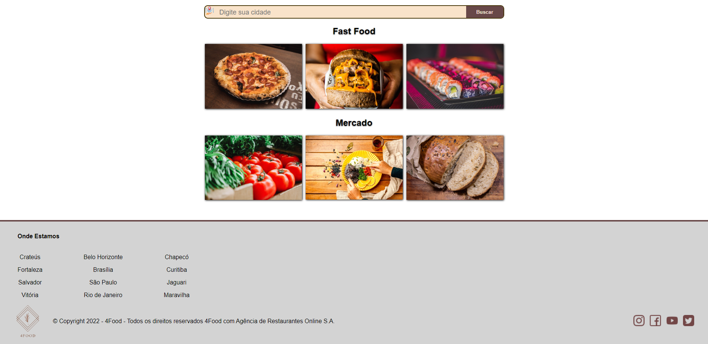
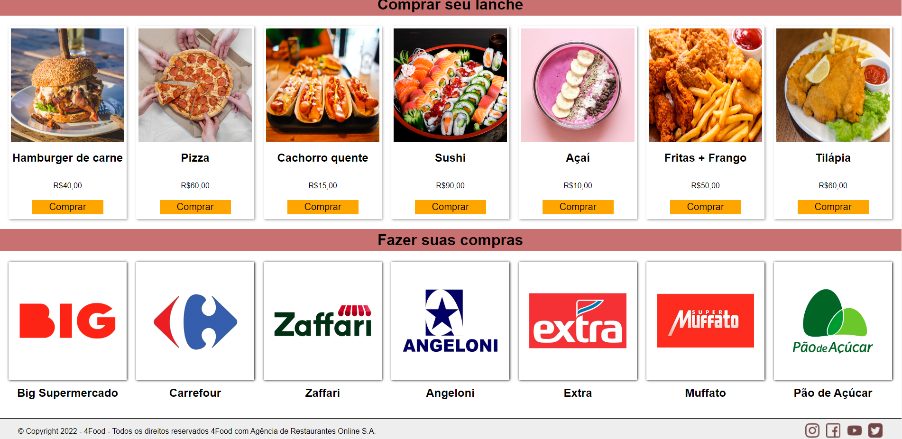
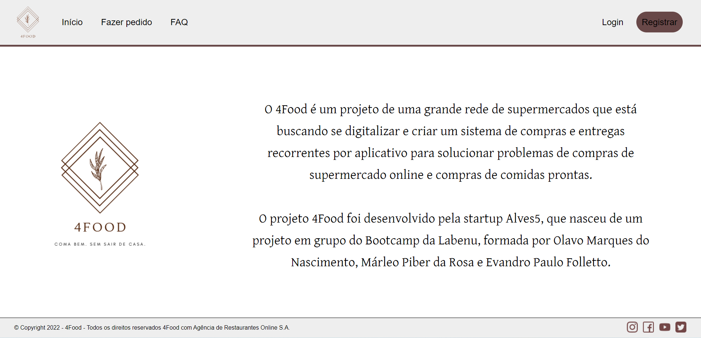
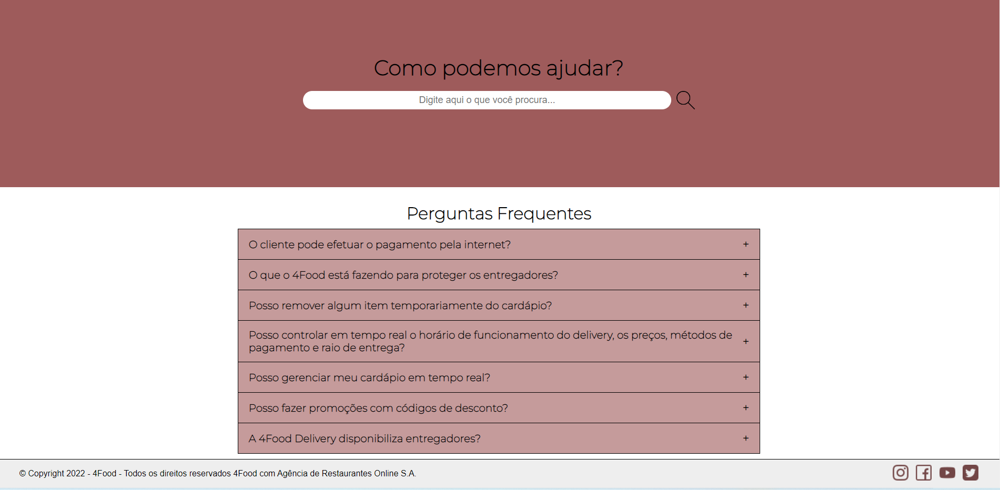
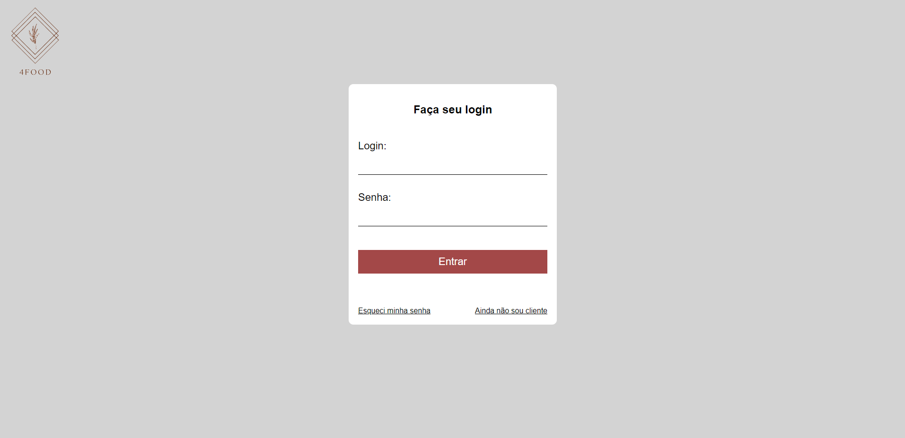
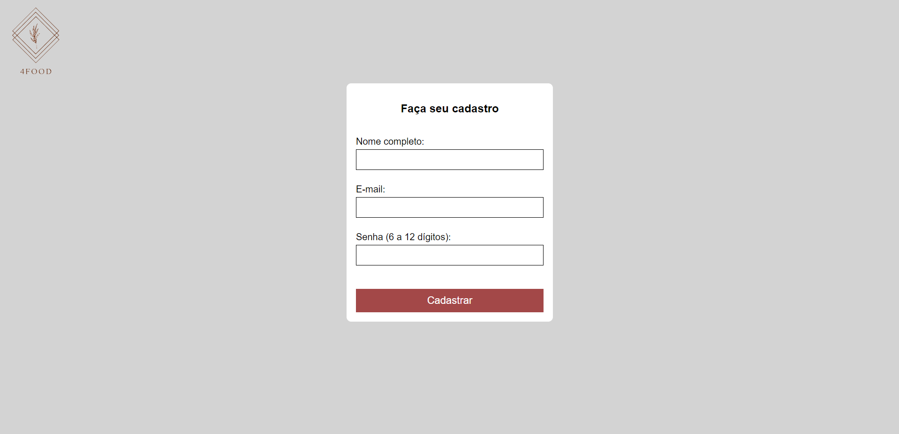
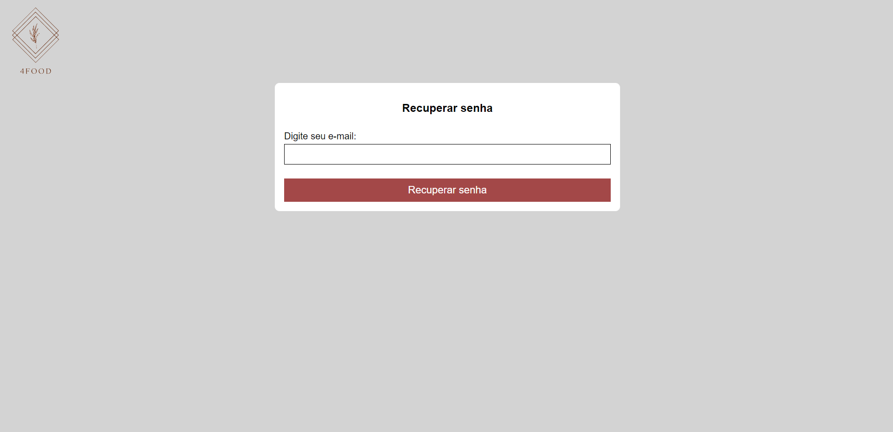

# `Projeto`
Projeto 4Food

# `Link`
[Clique aqui para acessar](http://4food-alves.surge.sh/)

# `Descrição`
[Projeto desenvolvido na semana 5 do curso Labenu]  
O Projeto 4Food foi desenvolvido dentro do curso Full-Stack Web Developer da Labenu, o qual consiste em um sistema de compras (tanto de supermercado quanto de fast food) e entregas de comidas por aplicativo. Para organização, o site é composto por um menu superior, horizontal, no qual existem as seguintes abas:  
**- Página Início:** contém um menu superior, um campo de busca (sem tal funcionalidade) e ícones de fast food e mercado clicáveis. No rodapé existem algumas informações e também ícones das redes, clicáveis  
**- Página Fazer pedido:** são listados inúmeros cards de fast food e também de supermercados.  
**- Página Quem somos:** uma página de apresentação da ferramenta e dos componentes do grupo.  
**- Página FAQ:** contém um campo de busca (sem tal funcionalidade) e uma seção de perguntas frequentes, onde é possível interagir com estas.  
**- Página Login:** contém um formulário para efetuar o login na página (sem tal funcionalidade). Possui ainda dois botões: "esqueci minha senha" e "ainda não sou cliente", este último que redireciona o usuário para a página Registrar.  
**- Página Registrar:** contém um formulário para efetuar o cadastrado na plataforma (sem tal funcionalidade).  

# `Tecnologias utilizadas`

# `Autores`
Evandro Paulo Folletto
 
  
 

Márleo Piber da Rosa
 
 
 

Olavo Marques do Nascimento
 
 

# `Imagens`
## Aba "Início"

## Aba "Fazer pedido"

## Aba "Quem somos"

## Aba "FAQ"

## Aba "Login"

## Aba "Registrar"

## Aba "Restaurar senha"

